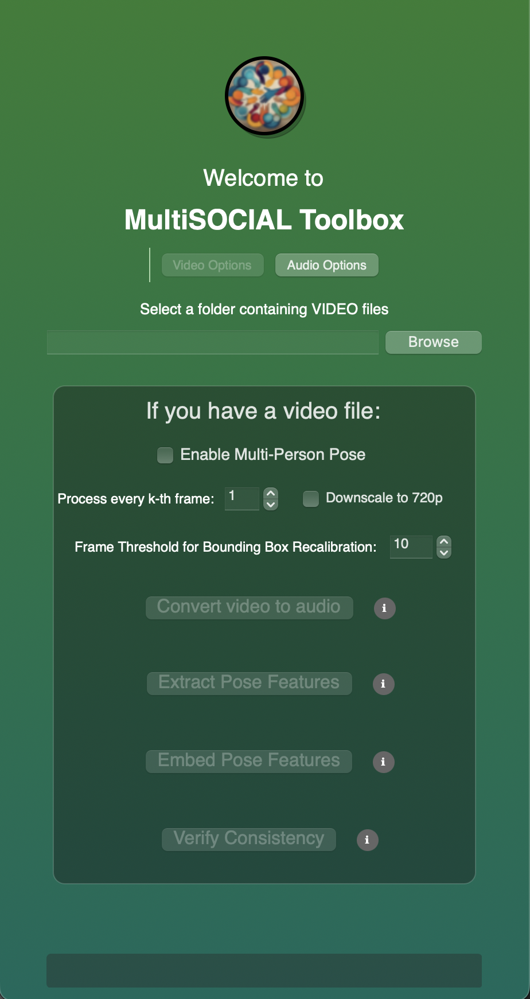

# MultiSOCIAL_toolbox
Toolbox for multimodal interaction analysis for text, audio, and video information.

## How can I use MultiSOCIAL Toolbox?

The toolbox allows you to process audio and video files of conversation.

# Installation

## MAC
1. Download the toolbox code by going to [this link](https://github.com/Tahiya31/MultiSOCIAL_toolbox) and click on **Code**.
2. Click on **Download Zip** to download the entire code folder. (You can also use ``git clone`` command to clone the repository.)
3. Open the **Terminal** application.
4. Go to the folder where **MultiSOCIAL_toolbox** is saved. (On Mac OS, typically the location is ``../Users/(name of the user)/Downloads/``)
   * You can run ``cd Downloads/MultiSOCIAL_toolbox`` to achieve this.
5. Run this single command to set up and launch the toolbox:
   * ``bash run_app.sh``


## WINDOWS

1. Download the toolbox code by going to [this link](https://github.com/Tahiya31/MultiSOCIAL_toolbox) and click on **Code**.
2. Click on **Download Zip** to download the entire code folder. (You can also use ``git clone`` command to clone the repository.)
3. Open **Command Prompt** (or PowerShell).
4. Go to the folder where **MultiSOCIAL_toolbox** is saved. (Typically this location is ``../Users/(name of the user)/Downloads/``)
   * You can run ``cd Downloads\MultiSOCIAL_toolbox`` to achieve this.
5. Run this single command to set up and launch the toolbox:
   * ``run_app.bat``


# Usage
Once launched, MultiSOCIAL Toolbox application looks like this.



The toolbox takes two types of input: audio (.wav file) and video (.mp4 file).

## Video file
**Convert video to audio** If you have a video file of human interaction and would like to convert it to a audio file in .wav format, this step is for you.
  * Use the ``Browse`` button to locate your input video file.
  * Then press **Convert video to audio** button.
  * Once the .wav file is ready, a dialogue box will let you know the output file is ready.

You should see three folders within the same folder as your input video.
  * `converted_audio`: Contains the WAV files produced by **Convert video to audio**.
  * `pose_features`: Contains the CSV pose feature files produced by **Extract Pose Features**.
  * `embedded_pose`: Contains the rendered pose-overlay videos produced by **Embed Pose Features**.


**Extract Pose Features** If you are interested in extracting pose or body key-points from the video, this step uses [MediaPipe](https://github.com/google-ai-edge/mediapipe/blob/master/docs/solutions/pose.md) to achieve this. This step returns 33 body pose land marks. For more details on MediaPipe, please check out the [official page](https://github.com/google-ai-edge/mediapipe/blob/master/docs/solutions/pose.md). 
  * Use the ``Browse`` button to locate your input video file.
  * Then press **Extract Pose Features** button. This step may take some time.
  * Note: If your video has multiple people, you must select **Enable Multi-person Pose** for getting pose information of each people.
  * Once the pose features are extracted, you can find them in **pose_features** folder created before.
  * **For multi-person mode**: Each outpur csv file will represent a single person's information (files will be named as {name of original video file}_multi_ID_0, {name of original video file}_multi_ID_1,etc.
  * **CSV format** Each row represents a frame, each column represents features. For each of the 33 body land marks, you should see 4 columns:
    * x and y: Landmark coordinates normalized to [0.0, 1.0] by the image width and height respectively.
    * z: Represents the landmark depth with the depth at the midpoint of hips being the origin, and the smaller the value the closer the landmark is to the camera. The magnitude of z uses roughly the same scale as x.
    * confidence: A value in [0.0, 1.0] indicating the likelihood of the landmark being visible (present and not occluded) in the image.

**Embed Pose Features** If you are interested in embedding body key-points extracted from Mediapipe on each frames, this step uses [MediaPipe](https://github.com/google-ai-edge/mediapipe/blob/master/docs/solutions/pose.md) to achieve this. 
  * Use the ``Browse`` button to locate your input video file.
  * Then press **Embed Pose Features** button. A window will pop up where you will see each frame being processed and body key-points being embedded. [We are no longer supporting the real-time embedding as it makes other simultaneous processes slower]
  * Once all the frames are processed, an output video will appear in the **embedded_pose** folder where your input video is located.
  * **Note: Embed pose features only supports a single person video at this moment.**

### Verify Consistency (Pose QA)
After extracting pose CSVs and generating embedded pose videos, you can run **Verify Consistency** to compare them.
  * Pre-requisites:
    * `pose_features/` must contain CSVs generated from **Extract Pose Features**.
    * `embedded_pose/` must contain pose-overlay videos generated from **Embed Pose Features**.
  * The tool creates a `verification/` folder in your dataset directory with:
    * per-video JSON + CSV reports (hit rate, SSIM, etc.)
    * `worst_frames/` subfolder containing reference frames for quick inspection
    * `summary.json` aggregating all runs
  * Use this to spot pose drift or embedding issues before downstream analysis.

## Audio file
**Extract Audio Features** If you are interested in extracting speech features from human speech during interaction, this step uses [OpenSMILE](https://audeering.github.io/opensmile-python/) to achieve this. This step currently uses predetermined feature sets (ComParE 2016) from OpenSMILE. For more details on OpenSMILE, please check their official [documentation page](https://audeering.github.io/opensmile-python/).
  * Use the ``Browse`` button to locate your input audio file. You can select the audio located in **converted_audio** folder as well.
  * Then press **Extract Audio Features** button.
  * Once the audio features are extracted, a dialogue box will let you know the output file is ready.

  You should see two folders within your input folder (containing audio) now.
  * audio_features: This will contain all the csv files containing audio features from the **Extract Audio Features** option.
  * transcripts: This will contain all the .txt files containing transcriptions of the audio from the **Extract Transcripts** option
    
  *  **CSV format for Audio feature** Each file includes three timestamp columns (`Timestamp_Seconds`, `Timestamp_Milliseconds`, `Timestamp_Formatted`) followed by the 65 ComParE 2016 feature columns. Each row represents a frame/sample.

**Extract Transcripts** If you are interested in extracting transcript of the conversation, this step now uses [Whisper Large V3 Turbo](https://huggingface.co/openai/whisper-large-v3-turbo) for automatic speech recognition (with GPU/MPS acceleration when available). For more details on Whisper, please check their official documentation page [here](https://github.com/openai/whisper).
  * Use the ``Browse`` button to locate your input audio file.
  * Then press **Extract Transcripts** button.
  * Once the transcript is extracted, a dialogue box will let you know the output file is ready.
  * You can find them in **transcripts** folder created before.

### Optional: Speaker diarization with PyAnnote
You can optionally label who is speaking in the transcript (speaker diarization). In the GUI, enable the checkbox for speaker diarization before running **Extract Transcripts**.

- **If the checkbox is OFF**: Only Whisper runs and a plain transcript is saved.
- **If the checkbox is ON**: Whisper runs and PyAnnote is used to add speaker labels. The first time, you will be prompted for a Hugging Face access token because PyAnnote models require one. The diarized output is saved directly in the transcript file with inline speaker segments, e.g.:

```
SPEAKER_00: [00:00.000 - 00:07.000] What about things that you're afraid of? ...
SPEAKER_01: [00:11.000 - 00:19.000] It's a hard question. I'm not really scared of anything...
```

How to get and use the Hugging Face token (one-time setup):
1. Create/sign in to a Hugging Face account: ``https://huggingface.co``
2. Accept the model licenses (both pages):
   * ``https://huggingface.co/pyannote/speaker-diarization``
   * ``https://huggingface.co/pyannote/segmentation``
3. Create an access token: go to ``https://huggingface.co/settings/tokens`` → **New token** (scope: "Read") → copy the token.
4. In MultiSOCIAL Toolbox, when prompted, paste the token and confirm. The app will remember it during the session.
   * **Tip**: To avoid entering the token every time, create a `.env` file in the project root and add `HF_TOKEN=your_token_here`. The app will load it automatically.

Notes:
- If you cancel or the token is invalid, the app continues with transcript only (no diarization).
- The first diarization run may download models and can take a few minutes.
- **Offline Mode**: Once models are downloaded, they are cached locally. Subsequent runs will use the cached models, allowing offline usage.
- Speaker labels are heuristic (e.g., ``SPEAKER_00``, ``SPEAKER_01``) and do not identify real names.

### Audio-Transcript Alignment
This feature aligns your extracted audio features (from OpenSMILE) with word-level transcripts (from Whisper). This is useful for analyzing acoustic features of specific words.

1.  **Extract Audio Features**: Run this first to generate the `.csv` feature files.
2.  **Align Features**: Click the **Align Features** button.
    *   It generates a detailed word-level transcript (`_words.json`).
    *   It merges the audio features with each word based on timestamps.
    *   The result is saved as `_aligned.csv` in the `audio_features` folder.
    *   **Note**: Features are averaged over the duration of each word.

# Troubleshooting

* I am running into error in the **Convert video to audio** step that says ``An error occured [WinError 2]: The system cannot find the file specified.``

  Or

  in **Extract Transcript** step that says ``An error occured during transcript extraction: ffmpeg was not found but required to load audio file form filename``

  * We need ffmpeg framework for these two steps. For Windows we need to ffmpeg from [here](https://ffmpeg.org/download.html).
  * Follow the steps described here to add [ffmpeg](https://phoenixnap.com/kb/ffmpeg-windows) to the environment PATH so that it can be used from Command Prompt.
  * You may need to close **Command Prompt** and re-open to allow this change to take effect.
 
* I am seeing warnings suggesting to set the path to certain package directories installed by this toolbox.
  * You can follow the link to add ``ffmpeg`` to the environment PATH above or [this link](https://stackoverflow.com/questions/44272416/how-to-add-a-folder-to-path-environment-variable-in-windows-10-with-screensho) to add them.
 
* I am getting an error during installation similar to ``ERROR: Failed building wheel for pi-heif`` or ``error: failed-wheel-build-for-install``
  * Why this happens: ``pi-heif`` provides HEIF/AVIF image support in Python and needs the system ``libheif`` library when a prebuilt wheel is not available for your OS/Python/architecture. On some machines, ``pip`` falls back to building from source, which fails without ``libheif`` present.
  * What to do:
    * macOS:
      * Install Homebrew if you don't have it yet by following the instructions here: [Homebrew](https://brew.sh).
      * Then install ``libheif``:
        * ``brew install libheif``
      * Re-run the toolbox setup command (``bash run_app.sh``).
    * Windows:
      * Install vcpkg (Microsoft's C/C++ package manager). Quick start: [vcpkg getting started](https://learn.microsoft.com/en-us/vcpkg/get_started/get-started).
      * In ``Command Prompt`` or ``PowerShell``:
        * ``git clone https://github.com/microsoft/vcpkg.git``
        * ``cd vcpkg``
        * ``.\bootstrap-vcpkg.bat``
        * (Optional, if you need specific codec backends for HEIF/AVIF) e.g., install AOM: ``vcpkg install aom:x64-windows``
        * Install libheif: ``vcpkg install libheif:x64-windows``
        * (Optional) Integrate with Visual Studio: ``vcpkg integrate install``
      * Re-run the toolbox setup command (``run_app.bat``).
  * After installing ``libheif``, ``pip`` can either use a compatible prebuilt wheel or successfully build ``pi-heif`` from source.


## Acknowledgement

We thank the authors and developers of ``MediaPipe``, ``OpenSMILE``, ``YOLOv5`` and ``whisper`` for their awesome contributions and making their code open-sourced which we use to develop ``MultiSOCIAL toolbox``. 

## Team

``MultiSOCIAL toolbox`` is developed by Tahiya Chowdhury, Veronica Romero, Alexandra Paxton and Muneeb Nafees.

## Disclaimer

Automated tools can be inaccurate and should be used after human verification for correctedness.

## Help us improve this toolbox!
[Please leave your feedback in this form.](https://docs.google.com/forms/d/e/1FAIpQLScGkEu-LfLAa_IGNOXG25trtMf8k12FFPymObBRDmLdPkAvxQ/viewform)

 

  
