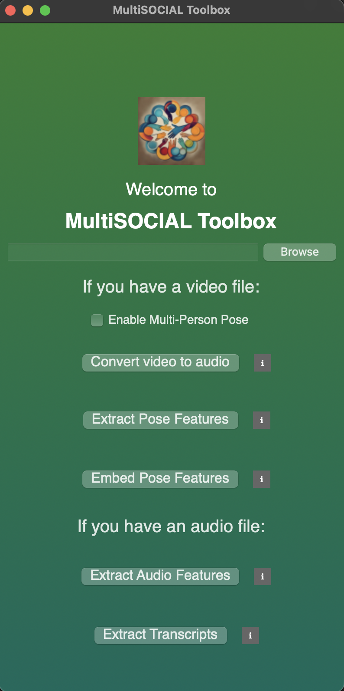

# MultiSOCIAL_toolbox
Toolbox for multimodal interaction analysis for text, audio, and video information.

## How can I use MultiSOCIAL Toolbox?

The toolbox allows you to process audio and video files of conversation.

# Installation

## MAC
1. Download the toolbox code by going to [this link](https://github.com/Tahiya31/MultiSOCIAL_toolbox) and click on **Code**.
2. Click on **Download Zip** to download the entire code folder. (You can also use ``git clone`` command to clone the repository.)
3. Open the **Terminal** application.
4. Go to the folder where **MultiSOCIAL_toolbox** is saved. (On Mac OS, typically the location is ``../Users/(name of the user)/Downloads/``)
   * You can run ``cd Downloads/MultiSOCIAL_toolbox`` to achieve this.
5. Run ``python app.py.``
   * If you run into error saying **Python is not recognized**, then you will need to install Python, the programming language our toolbox is written on, on your computer.
   * Install the latest version of Python for your MAC computer from [this link](https://www.python.org/downloads/macos/)
6. If the script above executes properly, all necessary packages should be installed and the MultiSOCIAL app should launch.      

## WINDOWS

1. Download the toolbox code by going to [this link](https://github.com/Tahiya31/MultiSOCIAL_toolbox) and click on **Code**.
2. Click on **Download Zip** to download the entire code folder. (You can also use ``git clone`` command to clone the repository.)
3. Open **Windows Command Prompt** application.
4. Go to the folder where **MultiSOCIAL_toolbox** is saved. (Typically this location is ``../Users/(name of the user)/Downloads/``)
   * You can run ``cd Downloads/MultiSOCIAL_toolbox`` to achieve this.

5. Run ``python app.py.``
   * If you run into error saying **Python is not recognized**, then you will need to install Python, the programming language our toolbox is written on, on your computer.
   * Install the latest version of Python for your WINDOWS computer from [this link](https://www.python.org/downloads/windows/)
6. If the script above executes properly, all necessary packages should be installed and the MultiSOCIAL app should launch.

# Usage
Once launched, MultiSOCIAL Toolbox application looks like this.

The toolbox takes two types of input: audio (.wav file) and video (.mp4 file).

## Video file
**Convert video to audio** If you have a video file of human interaction and would like to convert it to a audio file in .wav format, this step is for you.
  * Use the ``Browse`` button to locate your input video file.
  * Then press **Convert video to audio** button.
  * Once the .wav file is ready, a dialogue box will let you know the output file is ready.

You should see three folders within your input folder (containing video) now.
  * converted_video: This will contain all the converted audio files from the **Convert video to audio** option.
  * embedded_pose: This will contain all the csv files containing extracted pose files from the **Extract Pose Features** option.
  * pose_features: This will contain all the video file with extracted pose embedded from the **Embed Pose Features** option.

**Extract Pose Features** If you are interested in extracting pose or body key-points from the video, this step uses [MediaPipe](https://github.com/google-ai-edge/mediapipe/blob/master/docs/solutions/pose.md) to achieve this. This step returns 33 body pose land marks. For more details on MediaPipe, please check out the [official page](https://github.com/google-ai-edge/mediapipe/blob/master/docs/solutions/pose.md). 
  * Use the ``Browse`` button to locate your input video file.
  * Then press **Extract Pose Features** button. This step may take some time.
  * Note: If your video has multiple people, you must select **Enable Multi-person Pose** for getting pose information of each people.
  * Once the pose features are extracted, you can find them in **pose_features** folder created before.
  * **For multi-person mode**: Each outpur csv file will represent a single person's information (files will be named as {name of original video file}_multi_ID_0, {name of original video file}_multi_ID_1,etc.
  * **CSV format** Each row represents a frame, each column represents features. For each of the 33 body land marks, you should see 4 columns:
  * x and y: Landmark coordinates normalized to [0.0, 1.0] by the image width and height respectively.
  * z: Represents the landmark depth with the depth at the midpoint of hips being the origin, and the smaller the value the closer the landmark is to the camera. The magnitude of z uses roughly the same scale as x.
  * confidence: A value in [0.0, 1.0] indicating the likelihood of the landmark being visible (present and not occluded) in the image.

**Embed Pose Features** If you are interested in embedding body key-points extracted from Mediapipe on each frames, this step uses [MediaPipe](https://github.com/google-ai-edge/mediapipe/blob/master/docs/solutions/pose.md) to achieve this. 
  * Use the ``Browse`` button to locate your input video file.
  * Then press **Embed Pose Features** button. A window will pop up where you will see each frame being processed and body key-points being embedded. [We are no longer supporting the real-time embedding as it makes other simultaneous processes slower]
  * Once all the frames are processed, an output video will appear in the **embedded_pose** folder where your input video is located.
  * **Note: Embed pose features only supports a single person video at this moment.**

## Audio file
**Extract Audio Features** If you are interested in extracting speech features from human speech during interaction, this step uses [OpenSMILE](https://audeering.github.io/opensmile-python/) to achieve this. This step currently uses predetermined feature sets (ComParE 2016) from OpenSMILE. For more details on OpenSMILE, please check their official [documentation page](https://audeering.github.io/opensmile-python/).
  * Use the ``Browse`` button to locate your input audio file. You can select the audio located in **converted_audio** folder as well.
  * Then press **Extract Audio Features** button.
  * Once the audio features are extracted, a dialogue box will let you know the output file is ready.

  You should see two folders within your input folder (containing audio) now.
  * audio_features: This will contain all the csv files containing audio features from the **Extract Audio Features** option.
  * transcripts: This will contain all the .txt files containing transcriptions of the audio from the **Extract Transcripts** option
    
  *  **CSV format for Audio feature** Each row represents a sample, each column represents features. For ComParE 2016, you should see 65 feature columns.

**Extract Transcripts** If you are interested in extracting transcript of the conversation, this step uses [whisper](https://github.com/openai/whisper) and [distil-whisper](https://github.com/huggingface/distil-whisper) for automatically recognize speech and transcribe. For more details on whisper, please check their offcial documentation page [here](https://github.com/openai/whisper).
  * Use the ``Browse`` button to locate your input audio file.
  * Then press **Extract Transcripts** button.
  * Once the transcript is extracted, a dialogue box will let you know the output file is ready.
  * You can find them in **transcripts** folder created before.

# Troubleshooting

* I am running into error in the **Convert video to audio** step that says ``An error occured [WinError 2]: The system cannot find the file specified.``

  Or

  in **Extract Transcript** step that says ``An error occured during transcript extraction: ffmpeg was not found but required to load audio file form filename``

  * We need ffmpeg framework for these two steps. For Windows we need to ffmpeg from [here](https://ffmpeg.org/download.html).
  * Follow the steps described here to add [ffmpeg](https://phoenixnap.com/kb/ffmpeg-windows) to the environment PATH so that it can be used from Command Prompt.
  * You may need to close **Command Prompt** and re-open to allow this change to take effect.
 
* I am seeing warnings suggesting to set the path to certain package directories installed by this toolbox.
  * You can follow the link to add ``ffmpeg`` to the environment PATH above or [this link](https://stackoverflow.com/questions/44272416/how-to-add-a-folder-to-path-environment-variable-in-windows-10-with-screensho) to add them.
 

## Acknowledgement

We thank the authors and developers of ``MediaPipe``, ``OpenSMILE``, and ``whisper`` for their awesome contributions and making their code open-sourced which we use to develop ``MultiSOCIAL toolbox``. 

## Team

``MultiSOCIAL toolbox`` is developed by Tahiya Chowdhury, Veronica Romero, and Alexandra Paxton``.

## Disclaimer

Automated tools can be inaccurate and should be used after human verification for correctedness.

## Help us improve this toolbox!
[Please leave your feedback in this form.](https://docs.google.com/forms/d/e/1FAIpQLScGkEu-LfLAa_IGNOXG25trtMf8k12FFPymObBRDmLdPkAvxQ/viewform)

 

  
