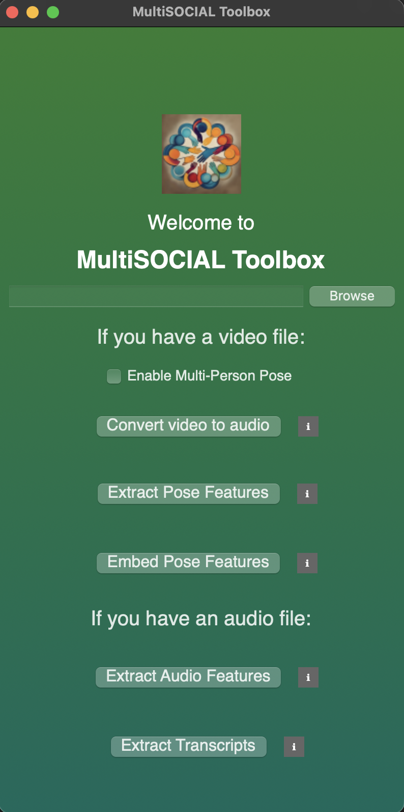

# MultiSOCIAL_toolbox
Toolbox for multimodal interaction analysis for text, audio, and video information.

Current release/runtime baseline:
- Python `3.10.x`
- `Standard` profile: base toolbox
- `Complete` profile: base toolbox plus optional speaker diarization support

## How can I use MultiSOCIAL Toolbox?

The toolbox allows you to process audio and video files of conversation.

Quick links:
- [Installation](#installation)
- [Usage](#usage)
- [Video files](#video-files)
- [Audio files](#audio-files)
- [Troubleshooting](#troubleshooting)

## Installation

There are two ways to use MultiSOCIAL Toolbox:

1. **Packaged desktop release**
   This is the recommended option for most users. You do **not** need to install Python manually.
2. **Source install using the launcher scripts**
   This is mainly for contributors or users running directly from the repository. You **must** have Python `3.10.x` installed first.

## Option 1: Packaged desktop releases

Packaged builds are attached to the repo's **GitHub Releases** page.

- `Standard` build: base toolbox
- `Complete` build: base toolbox plus diarization support

Official user downloads should come from **Releases**.
The GitHub Actions **Build Releases** workflow also produces artifacts, but those are mainly useful for branch/fork testing before an official release is published.
Workflow artifacts now download as a single zip that extracts directly into one app folder. For Windows, the `.exe` is at the top level of that extracted folder.

### Where to find them

1. Open the repository on GitHub.
2. Click **Releases** on the right side of the repo page.
3. Open the latest release.
4. Download the artifact for your system:
   * macOS:
     * `MultiSOCIAL-Standard-macos.zip`
     * `MultiSOCIAL-Complete-macos.zip`
   * Windows:
     * `MultiSOCIAL-Standard-windows.zip`
     * `MultiSOCIAL-Complete-windows.zip`

### Branch or fork testing artifacts

1. Open the **Actions** tab on GitHub.
2. Open the relevant **Build Releases** workflow run.
3. Download the artifact for your system.
4. Extract the downloaded zip once.
5. Open the extracted app folder:
   * Windows: the `.exe` is directly inside that folder
   * macOS: the `.app` is directly inside that folder

### macOS packaged release steps

1. Download the `.zip` file from **Releases**.
2. Double-click the `.zip` to extract it.
3. Open **Terminal**.
4. Remove the quarantine flag from the extracted app:
   * `xattr -dr com.apple.quarantine "/path/to/MultiSOCIAL-Standard.app"`
   * or
   * `xattr -dr com.apple.quarantine "/path/to/MultiSOCIAL-Complete.app"`
5. Open the app:
   * double-click the `.app`, or
   * right-click the `.app` and choose **Open**

If your macOS build is signed and notarized in a future release, the quarantine-removal step may not be needed.

### Windows packaged release steps

1. Download the `.zip` file from **Releases**.
2. Extract the `.zip`.
3. Open the extracted folder.
4. Launch the app:
   * `MultiSOCIAL-Standard.exe`, or
   * `MultiSOCIAL-Complete.exe`

If Windows shows a trust warning on an unsigned build:
1. Click **More info**
2. Click **Run anyway**

If the build is signed in a future release, this warning should be reduced or removed.

## Option 2: Source install from the repository

This path uses the launcher scripts in the repo and requires Python `3.10.x`.

### Prerequisite

- Install Python `3.10.x`

Do not use Python `3.11` or `3.12` for this project.

### macOS source install

1. Download or clone the repository.
2. Open **Terminal**.
3. Go to the repository folder:
   * `cd /path/to/MultiSOCIAL_toolbox`
4. Run:
   * `bash run_app.sh`
5. Choose one profile when prompted:
   * `Standard`
   * `Complete`

The script will:
- create or reuse `.venv`
- install the correct dependencies
- launch the app

### Windows source install

1. Download or clone the repository.
2. Install Python `3.10.x`.
3. Open **Command Prompt**.
4. Go to the repository folder:
   * `cd \path\to\MultiSOCIAL_toolbox`
5. Run:
   * `run_app.bat`
6. Choose one profile when prompted:
   * `Standard`
   * `Complete`

The script will:
- create or reuse `.venv`
- install the correct dependencies
- launch the app

## Which version should I choose?

- Choose `Standard` if you want the main toolbox features without diarization.
- Choose `Complete` if you also want speaker diarization support.

If you are unsure, start with `Standard`.


## Usage
Once launched, the MultiSOCIAL Toolbox application looks like this.



The toolbox takes two types of input: audio (`.wav`, `.wave`, `.aiff`, `.aif`, `.aifc`, `.flac`, `.caf`, `.au`, `.snd`) and video (`.mp4`, `.avi`, `.mov`, `.mkv`, `.m4v`).

## How the toolbox keeps your workflow safe
The toolbox runs one task at a time and guides you through the right order of steps.

* **One task at a time.** While a task is running, every other button and setting is disabled and only **Cancel** stays active. This prevents two tasks from running at once or interfering with each other, and means rapid or accidental clicks can't start a second job.
* **Steps unlock when their inputs exist.** Buttons that depend on earlier results stay greyed out until the required files are actually present on disk (the toolbox checks the files, not just whether you clicked a button before). Hover over a greyed-out button to see what's missing and what to do next. Specifically:
  * **Embed Pose Features** unlocks once **Extract Pose Features** has produced pose CSVs in the `pose_features` folder.
  * **Embed Transcript on Video** unlocks once **Extract Transcripts** has produced matching `.srt` files in the `transcripts` folder for every selected video.
  * If **Add captions to pose-embedded video** is checked, **Embed Transcript on Video** also waits for matching videos in `embedded_pose`.
  * **Verify Pose Match** unlocks once **Embed Pose Features** has produced videos in the `embedded_pose` folder.
* **Clear messages.** If a step can't run, a plain-language message tells you what is missing, what to do next, and which folder the required files belong in.

## Video files
**Convert video to audio** If you have a supported video file of human interaction and would like to convert it to an audio file in `.wav` format, this step is for you.
  * Use the ``Browse`` button to locate your input video file.
  * Then press **Convert video to audio** button.
  * Once the .wav file is ready, a dialogue box will let you know the output file is ready.

### Typical video outputs
You should see these folders within the same folder as your input video. Each folder is created only when the matching step runs.
  * `converted_audio`: Contains the WAV files produced by **Convert video to audio**.
  * `pose_features`: Contains the CSV pose feature files produced by **Extract Pose Features**.
  * `embedded_pose`: Contains the rendered pose-overlay videos produced by **Embed Pose Features**.
  * `captioned_video`: Contains the captioned videos produced by **Embed Transcript on Video**.

For a folder with several videos, the typical output looks like this:

```
YourVideoFolder/
  session01.mp4
  session02.mp4
  converted_audio/
    session01.wav
    session02.wav
  pose_features/
    session01_ID_0.csv
    session01_meta.json
    session02_ID_0.csv
    session02_meta.json
  embedded_pose/
    session01_pose.mp4
    session02_pose.mp4
  transcripts/
    session01.txt
    session01.srt
    session01_words.json
    session02.txt
    session02.srt
    session02_words.json
  audio_features/
    session01.csv
    session01_aligned.csv
    session02.csv
    session02_aligned.csv
  captioned_video/
    session01_captioned.mp4
    session01_pose_captioned.mp4
    session02_captioned.mp4
    session02_pose_captioned.mp4
  verification/
    summary.json
    session01_pose_report.json
    session01_pose_worst.csv
    worst_frames/
```

If **Enable Multi-person Pose** is used, pose CSVs and embedded pose videos include `_multi`, for example `session01_multi_ID_0.csv` and `session01_multi_pose.mp4`. If both single-person and multi-person pose videos exist, **Add captions to pose-embedded video** uses the newest embedded pose video.


**Extract Pose Features** If you are interested in extracting pose or body key-points from the video, this step uses [MediaPipe](https://github.com/google-ai-edge/mediapipe/blob/master/docs/solutions/pose.md). This step returns 33 body pose landmarks. For more details on MediaPipe, please check out the [official page](https://github.com/google-ai-edge/mediapipe/blob/master/docs/solutions/pose.md). 
  * Use the ``Browse`` button to locate your input video file.
  * Then press **Extract Pose Features** button. This step may take some time.
  * Note: If your video has multiple people, you must select **Enable Multi-person Pose** for getting pose information of each person.
  * **Performance Options:**
    * **Process every k-th frame**: Skip frames to speed up processing (e.g., k=2 processes every other frame).
    * **Downscale to 720p**: Reduce video resolution during processing for faster extraction.
    * **Frame Threshold for Bounding Box Recalibration**: Controls how often person bounding boxes are re-detected in multi-person mode.
  * Once the pose features are extracted, you can find them in **pose_features** folder created before.
  * **For multi-person mode**: Each output csv file will represent a single person's information (files will be named as {name of original video file}_multi_ID_0, {name of original video file}_multi_ID_1, etc.).
  * **CSV format** Each row represents a frame, each column represents features. For each of the 33 body landmarks, you should see 4 columns:
    * x and y: Landmark coordinates normalized to [0.0, 1.0] by the image width and height respectively.
    * z: Represents the landmark depth with the depth at the midpoint of hips being the origin, and the smaller the value the closer the landmark is to the camera. The magnitude of z uses roughly the same scale as x.
    * confidence: A value in [0.0, 1.0] indicating the likelihood of the landmark being visible (present and not occluded) in the image.

**Embed Pose Features** Overlay body key-points from extracted pose CSVs onto each video frame (run **Extract Pose Features** first). The **Embed Pose Features** button stays greyed out until extraction has produced pose CSVs for every selected video; hover over it for a reminder.
  * Use the ``Browse`` button to locate your input video file.
  * Then press **Embed Pose Features** button. The toolbox reads pose CSVs from `pose_features/` and draws landmarks onto the video. Each tracked person gets a stable color with an on-screen legend, and each landmark's brightness reflects its detection confidence: brighter means more confident, dimmer means less confident.
  * Embed automatically reuses the frame stride recorded at extraction time, so the overlay stays aligned with the CSV rows regardless of the stride selected when embedding.
  * Once all the frames are processed, an output video will appear in the **embedded_pose** folder where your input video is located.

**Embed Transcript on Video** Burn the turn-by-turn transcript onto the video as captions so you can watch the video and read the transcript in sync — useful for evaluating transcription accuracy. The **Embed Transcript on Video** button stays greyed out until **Extract Transcripts** (on the Audio tab) has produced matching `.srt` files for the selected videos; hover over it for a reminder.
  * First run **Extract Transcripts** on the Audio tab. This now also saves a `.srt` caption file (one caption per spoken segment, prefixed with the speaker label when diarization is enabled) into the `transcripts` folder, alongside the existing `.txt` transcript.
  * Use the ``Browse`` button to select the same folder as your input video, then press **Embed Transcript on Video**.
  * The captioned video is written to the **captioned_video** folder as `<name>_captioned.mp4`. The audio is copied unchanged and the original video is left untouched; only a new captioned copy is created.
  * If the button stays greyed out, rerun **Extract Transcripts** and make sure each audio file has the same base name as its video (for example, `session01.wav` produces captions for `session01.mp4`).
  * Optional: check **Add captions to pose-embedded video** to burn captions onto the pose overlay instead of the raw source (`*_pose_captioned.mp4` in `captioned_video/`). If both single-person and multi-person pose-overlay videos exist, the newest one is used.

### Verify Pose Match (Pose QA)
After extracting pose CSVs and generating embedded pose videos, you can run **Verify Pose Match** to compare them.
  * Pre-requisites:
    * `pose_features/` must contain CSVs generated from **Extract Pose Features**.
    * `embedded_pose/` must contain pose-overlay videos generated from **Embed Pose Features**.
  * The tool creates a `verification/` folder in your dataset directory with:
    * per-video JSON + CSV reports (landmark hit rate against the embedded overlay)
    * `worst_frames/` subfolder containing reference frames for quick inspection
    * `summary.json` aggregating all runs
  * Use this to spot pose drift or embedding issues before downstream analysis.

## Audio files
**Extract Audio Features** If you are interested in extracting speech features from human speech during interaction, this step uses [OpenSMILE](https://audeering.github.io/opensmile-python/) to achieve this. This step currently uses predetermined feature sets (ComParE 2016) from OpenSMILE. For more details on OpenSMILE, please check their official [documentation page](https://audeering.github.io/opensmile-python/).
  * Use the ``Browse`` button to locate your supported input audio file. You can select audio located in **converted_audio** as well.
  * Then press **Extract Audio Features** button.
  * Once the audio features are extracted, a dialogue box will let you know the output file is ready.

### Typical audio outputs
You should see two folders within your input folder (containing audio) now.

  * `audio_features`: Contains the CSV files produced by **Extract Audio Features** and **Align Features**.
  * `transcripts`: Contains the `.txt`, `.srt`, and `_words.json` files produced by **Extract Transcripts**.

For a folder with several audio files, the typical output looks like this:

```
YourAudioFolder/
  session01.wav
  session02.wav
  audio_features/
    session01.csv
    session01_aligned.csv
    session02.csv
    session02_aligned.csv
  transcripts/
    session01.txt
    session01.srt
    session01_words.json
    session02.txt
    session02.srt
    session02_words.json
```

The `_words.json` files are created when word timestamps are requested or when **Align Features** needs them. Single-file runs use the same names, just for one file.
    
**CSV format for audio features** Each file includes three timestamp columns (`Timestamp_Seconds`, `Timestamp_Milliseconds`, `Timestamp_Formatted`) followed by the 65 ComParE 2016 feature columns. Each row represents a frame/sample.

**Extract Transcripts** If you are interested in extracting transcript of the conversation, this step now uses [Whisper Large V3 Turbo](https://huggingface.co/openai/whisper-large-v3-turbo) for automatic speech recognition (with GPU/MPS acceleration when available). For more details on Whisper, please check their official documentation page [here](https://github.com/openai/whisper).
  * Use the ``Browse`` button to locate your input audio file.
  * Then press **Extract Transcripts** button.
  * Each file is saved to the **transcripts** folder as soon as it finishes (`.txt`, plus `.srt` when segments are available), so you can inspect partial batch results while the rest are still processing.
  * Once the full batch completes, a dialogue box confirms success.
  * Alongside each `.txt` transcript, the toolbox also saves a `.srt` caption file in the same `transcripts` folder. This drives the **Embed Transcript on Video** step on the Video tab (see above).

### Optional: Speaker diarization with PyAnnote
You can optionally label who is speaking in the transcript (speaker diarization). In the GUI, enable the checkbox for speaker diarization before running **Extract Transcripts**.

- If diarization is not installed yet and your build supports self-install, click **Install Complete Toolbox** in the audio panel.
- Source installs can also select the `Complete` profile directly from `run_app.sh` or `run_app.bat`.

- **If the checkbox is OFF**: Only Whisper runs and a plain transcript is saved.
- **If the checkbox is ON**: Whisper runs and PyAnnote is used to add speaker labels. The first time, you will be prompted for a Hugging Face access token because PyAnnote models require one. The diarized output is saved directly in the transcript file with inline speaker segments, e.g.:

```
SPEAKER_00: [00:00.000 - 00:07.000] What about things that you're afraid of? ...
SPEAKER_01: [00:11.000 - 00:19.000] It's a hard question. I'm not really scared of anything...
```

How to get and use the Hugging Face token (one-time setup):
1. Create/sign in to a Hugging Face account: ``https://huggingface.co``
2. Accept the model licenses (both pages):
   * ``https://huggingface.co/pyannote/speaker-diarization``
   * ``https://huggingface.co/pyannote/segmentation``
3. Create an access token: go to ``https://huggingface.co/settings/tokens`` → **New token** (scope: "Read") → copy the token.
4. In MultiSOCIAL Toolbox, when prompted, paste the token and confirm. The app stores it in local app settings for future runs.
   * **Tip**: You can still set `HF_TOKEN` in your environment or a local `.env` file if you prefer.

Notes:
- If you cancel or the token is invalid, the app continues with transcript only (no diarization).
- The first diarization run may download models and can take a few minutes.
- **Offline Mode**: Once models are downloaded, they are cached locally. Subsequent runs will use the cached models, allowing offline usage.
- Speaker labels are heuristic (e.g., ``SPEAKER_00``, ``SPEAKER_01``) and do not identify real names.

### Audio-Transcript Alignment
This feature aligns your extracted audio features (from OpenSMILE) with word-level transcripts (from Whisper). This is useful for analyzing acoustic features of specific words.

1.  **Extract Audio Features**: Run this first to generate the `.csv` feature files.
2.  **Align Features**: Click the **Align Features** button.
    *   It generates a detailed word-level transcript (`_words.json`).
    *   It merges the audio features with each word based on timestamps.
    *   The result is saved as `_aligned.csv` in the `audio_features` folder.
    *   **Note**: Features are averaged over the duration of each word.

## Troubleshooting

### A button is greyed out

Greyed-out buttons usually mean a required file is missing. Hover over the button for the exact next step.

- **Embed Pose Features** needs matching pose CSVs in `pose_features/`.
- **Embed Transcript on Video** needs matching `.srt` files in `transcripts/`.
- If **Add captions to pose-embedded video** is checked, **Embed Transcript on Video** also needs matching videos in `embedded_pose/`.
- **Verify Pose Match** needs pose-overlay videos in `embedded_pose/`.

### Captions are missing or the caption button stays locked

Run **Extract Transcripts** for audio files with the same base name as the videos. For example:

```
session01.mp4
converted_audio/session01.wav
transcripts/session01.srt
```

If the `.srt` file is missing, rerun **Extract Transcripts**. If you want captions on the pose-overlay video, run **Embed Pose Features** first.

### Speaker diarization is slow or uses a lot of memory

Speaker diarization is optional and can be slower than plain transcription, especially on long files.

- Turn off **Enable speaker diarization** if you only need captions or a plain transcript.
- Diarization is only needed when you want speaker labels such as `SPEAKER_00` and `SPEAKER_01`.
- Word timestamps are not required for captions; they are mainly used by **Align Features**.
- On macOS, the app runs diarization on CPU to avoid large memory spikes.

### FFmpeg or video engine errors

The packaged app and current source setup try a bundled FFmpeg fallback automatically, so most users should not need to install FFmpeg manually.

- If **Convert video to audio**, **Embed Transcript on Video**, or caption burning reports a video-engine error, relaunch the app once so it can re-check the bundled FFmpeg.
- If the bundled fallback is unavailable on your machine, install FFmpeg and add it to `PATH`.
- On Windows, you can start from [ffmpeg.org](https://ffmpeg.org/download.html) and these [PATH setup steps](https://phoenixnap.com/kb/ffmpeg-windows).

### Warnings in the terminal

Some libraries print warnings about model loading, package paths, or cache folders. These warnings are usually safe to ignore if the requested output files are created.

- For packaged releases, only investigate warnings if a feature fails.
- For source installs, rerun `run_app.sh` or `run_app.bat` if a tool appears to be missing.

### Pose output looks wrong

Run **Verify Pose Match** after **Embed Pose Features**. It creates a `verification/` folder with a report and worst-frame thumbnails so you can quickly inspect whether the CSV and embedded video match.

If a multi-person video looks like it used the wrong overlay, remember that **Add captions to pose-embedded video** uses the newest pose-overlay video when both single-person and multi-person versions exist.
 
## Acknowledgement

We thank the authors and developers of ``MediaPipe``, ``OpenSMILE``, ``YOLOv5`` and ``whisper`` for their awesome contributions and making their code open-sourced which we use to develop ``MultiSOCIAL toolbox``. 

## Team

``MultiSOCIAL toolbox`` is developed by Tahiya Chowdhury, Veronica Romero, Alexandra Paxton and Muneeb Nafees.

## Disclaimer

Automated tools can be inaccurate and should be used after human verification for correctness.

## Help us improve this toolbox!
[Please leave your feedback in this form.](https://docs.google.com/forms/d/e/1FAIpQLScGkEu-LfLAa_IGNOXG25trtMf8k12FFPymObBRDmLdPkAvxQ/viewform)

 

  
